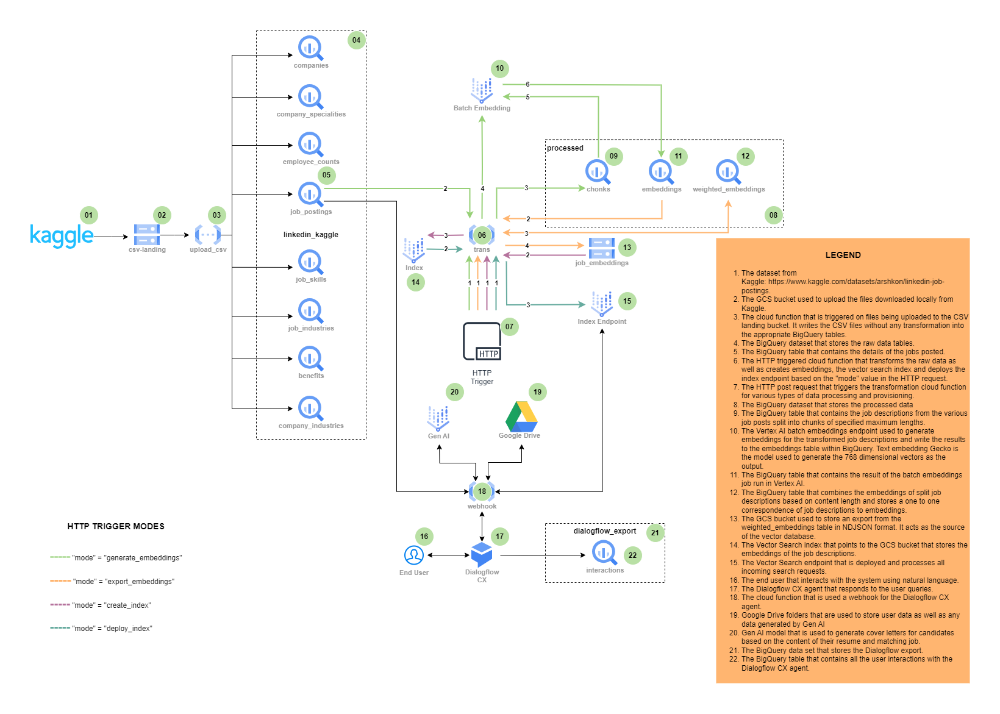
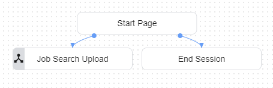
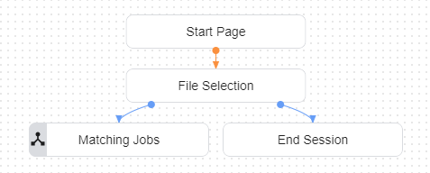
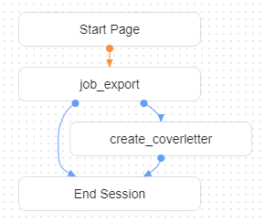

# Vector Match Job Search Dialogflow CX Agent

## Table of Contents
- [3.3.1 Code](#331-code)
  - [3.3.1.1 Code Repository](#3311-code-repository)
  - [3.3.1.2 Code Origin Certification](#3312-code-origin-certification)
- [3.3.2 Data](#332-data)
  - [3.3.2.1 Dataset in Google Cloud](#3321-dataset-in-google-cloud)
- [3.3.3 Whitepaper / Blog](#333-whitepaper--blog)
  - [3.3.3.1 Business Goal and Machine Learning Solution](#3331-business-goal-and-machine-learning-solution)
  - [3.3.3.2 Data Exploration](#3332-data-exploration)
  - [3.3.3.3 Feature Engineering](#3333-feature-engineering)
  - [3.3.3.4 Preprocessing and the Data Pipeline](#3334-preprocessing-and-the-data-pipeline)
  - [3.3.3.5 Machine Learning Model Design and Selection](#3335-machine-learning-model-design-and-selection)
  - [3.3.3.6 Machine Learning Model Training and Development](#3336-machine-learning-model-training-and-development)
  - [3.3.3.7 Machine Learning Model Evaluation](#3337-machine-learning-model-evaluation)
- [3.3.4 Proof of Deployment](#334-proof-of-deployment)
  - [3.3.4.1 Model/Application on Google Cloud](#3341-modelapplication-on-google-cloud)
  - [3.3.4.2 Callable Library/Application](#3342-callable-libraryapplication)
  - [3.3.4.3 Editable Model/Application](#3343-editable-modelapplication)


## 3.3.1 Code

### 3.3.1.1 Code Repository
The code repository for the Vector Match Job Search Dialogflow CX Agent can be found at [this GitHub link](https://github.com/intelia-agility/ml-spez.git). The repository contains all the code used in Demo #3, including scripts for data preprocessing, model training, evaluation, and deployment instructions.

To clone the repository and start exploring the code, use the following command in your terminal:

```bash
git https://github.com/intelia-agility/ml-spez.git
```

### 3.3.1.2 Code Origin Certification
We, intelia, confirm that all the code in this case study is original and developed within our organization.

## 3.3.2 Data

### 3.1.2.1 Dataset in Google Cloud

Every day, thousands of companies and individuals turn to LinkedIn in search of talent. This dataset contains a nearly comprehensive record of 15,000+ job postings listed over the course of 2 days, months apart. Each individual posting contains 27 valuable attributes, including the title, job description, salary, location, application URL, and work-types (remote, contract, etc), in addition to separate files containing the benefits, skills, and industries associated with each posting. The majority of jobs are also linked to a company, which are all listed in another csv file containing attributes such as the company description, headquarters location, and number of employees, and follower count.

The Vector Match Job Search Dialogflow CX Agent is hosted on Google Cloud Platform (GCP) with the project identifier `ml-spez-ccai`.

### Kaggle Dataset

The dataset on Kaggle can be found [here](https://www.kaggle.com/datasets/arshkon/linkedin-job-postings/versions/8)

GCP dataset for raw data: `ml-spez-ccai.linkedin_kaggle`

#### Job Postings

Table: `ml-spez-ccai.linkedin_kaggle.job_postings`

| Field Name                  | Mode      | Type      | Description                              |
|-----------------------------|-----------|-----------|------------------------------------------|
| job_id                      | NULLABLE  | STRING    | Job ID as defined by LinkedIn            |
| company_id                  | NULLABLE  | STRING    | Company ID as defined by LinkedIn        |
| title                       | NULLABLE  | STRING    | Job Title                                |
| description                 | NULLABLE  | STRING    | Job Description                          |
| max_salary                  | NULLABLE  | FLOAT64   | Maximum Salary                           |
| med_salary                  | NULLABLE  | FLOAT64   | Median Salary                            |
| min_salary                  | NULLABLE  | FLOAT64   | Minimum Salary                           |
| pay_period                  | NULLABLE  | STRING    | Pay Period                               |
| formatted_work_type         | NULLABLE  | STRING    | Work Type                                |
| location                    | NULLABLE  | STRING    | Job Location                             |
| applies                     | NULLABLE  | FLOAT64   | Number of applications when scraped      |
| original_listed_time        | NULLABLE  | STRING    | UNIX Listed Time                         |
| remote_allowed              | NULLABLE  | FLOAT64   | Permits Remote Work                      |
| views                       | NULLABLE  | FLOAT64   | Number of views when scraped             |
| job_posting_url             | NULLABLE  | STRING    | LinkedIn Posting URL                     |
| application_url             | NULLABLE  | STRING    | Job Application URL                      |
| application_type            | NULLABLE  | STRING    | Type of Application                      |
| expiry                      | NULLABLE  | STRING    | UNIX Expiry Time                         |
| closed_time                 | NULLABLE  | STRING    | UNIX Close Time                          |
| formatted_experience_level  | NULLABLE  | STRING    | Experience Level Required                |
| skills_desc                 | NULLABLE  | STRING    | Description of necessary skills          |
| listed_time                 | NULLABLE  | STRING    | UNIX Listed Time                         |
| posting_domain              | NULLABLE  | STRING    | Application Domain                       |
| sponsored                   | NULLABLE  | INT64     | Sponsored posting                        |
| work_type                   | NULLABLE  | STRING    | Type of Work                             |
| currency                    | NULLABLE  | STRING    | Currency of Salary                       |
| compensation_type           | NULLABLE  | STRING    | Compensation Type                        |

#### Job Skills

Table: `ml-spez-ccai.linkedin_kaggle.job_skills`

| Field Name   | Mode      | Type   | Description                           |
|--------------|-----------|--------|---------------------------------------|
| job_id       | NULLABLE  | STRING | Job ID as defined by LinkedIn         |
| skill_abr    | NULLABLE  | STRING | Skill abbreviation                    |

#### Job Industries

Table: `ml-spez-ccai.linkedin_kaggle.job_industries`

| Field Name    | Mode      | Type   | Description                        |
|---------------|-----------|--------|------------------------------------|
| job_id        | NULLABLE  | STRING | Job ID as defined by LinkedIn      |
| industry_id   | NULLABLE  | STRING | Industry ID                        |

#### Benefits

Table: `ml-spez-ccai.linkedin_kaggle.benefits`

| Field Name   | Mode      | Type     | Description                        |
|--------------|-----------|----------|------------------------------------|
| job_id       | NULLABLE  | STRING   | Job ID as defined by LinkedIn      |
| inferred     | NULLABLE  | INTEGER  |                                    |
| type         | NULLABLE  | STRING   | Benefit type                       |

#### Companies

Table: `ml-spez-ccai.linkedin_kaggle.companies`

| Field Name    | Mode      | Type     | Description                            |
|---------------|-----------|----------|----------------------------------------|
| company_id    | NULLABLE  | STRING   | Company ID                             |
| name          | NULLABLE  | STRING   | Name of the company                    |
| description   | NULLABLE  | STRING   | Description of the company             |
| company_size  | NULLABLE  | INTEGER  | Size of the company                    |
| state         | NULLABLE  | STRING   | State where the company is located     |
| country       | NULLABLE  | STRING   | Country where the company is located   |
| city          | NULLABLE  | STRING   | City where the company is located      |
| zip_code      | NULLABLE  | STRING   | Zip Code of the company address        |
| address       | NULLABLE  | STRING   | Address of the company                 |
| url           | NULLABLE  | STRING   | Website URL of the company             |

#### Company Industries

Table: `ml-spez-ccai.linkedin_kaggle.company_industries`

| Field Name   | Mode      | Type   | Description                                   |
|--------------|-----------|--------|-----------------------------------------------|
| company_id   | NULLABLE  | STRING | Company ID                                    |
| industry     | NULLABLE  | STRING | The industry to which the company belongs     |

#### Company Specialities

Table: `ml-spez-ccai.linkedin_kaggle.company_specialities`

| Field Name   | Mode      | Type   | Description                         |
|--------------|-----------|--------|-------------------------------------|
| company_id   | NULLABLE  | STRING | Company ID                          |
| speciality   | NULLABLE  | STRING | Speciality of the company           |

#### Employee Counts

Table: `ml-spez-ccai.linkedin_kaggle.employee_counts`

| Field Name       | Mode      | Type     | Description                                       |
|------------------|-----------|----------|---------------------------------------------------|
| company_id       | NULLABLE  | STRING   | Company ID                                        |
| employee_count   | NULLABLE  | INTEGER  | Employee count of the company                     |
| follower_count   | NULLABLE  | INTEGER  | Follower count of the company on LinkedIn         |
| time_recorded    | NULLABLE  | STRING   | UNIX time recorded                                |

### Processed Dataset

GCP dataset for processed data: `ml-spez-ccai.processed`

#### Chunks
This table contains the job descriptions truncated into chunks of a specified length.

Table: ml-spez-ccai.processed.chonks

| Field Name  | Type   | Mode      | Description                                                                                        |
|-------------|--------|-----------|----------------------------------------------------------------------------------------------------|
| job_id      | STRING | NULLABLE  | Job ID as defined by LinkedIn                                                                      |
| content     | STRING | NULLABLE  | The content of the job description                                                                 |
| chunk_size  | INT64  | NULLABLE  | The size of the content in the number of characters                                                |
| is_split    | BOOL   | NULLABLE  | Flag that indicates if the content is part of a job description that is split into multiple chunks |

#### Embeddings
This table contains the embeddings of the job descriptions that were truncated into chunks of a specified length.

Table: ml-spez-ccai.processed.embeddings

| Field Name   | Type   | Mode      | Description                                                                                        |
|--------------|--------|-----------|----------------------------------------------------------------------------------------------------|
| job_id       | STRING | NULLABLE  | Job ID as defined by LinkedIn                                                                      |
| content      | STRING | NULLABLE  | The content of the job description                                                                 |
| chunk_size   | INT64  | NULLABLE  | The size of the content in the number of characters                                                |
| is_split     | BOOL   | NULLABLE  | Flag that indicates if the content is part of a job description that is split into multiple chunks |
| predictions  | JSON   | NULLABLE  | Embeddings returned from the batch embedding endpoint                                              |
| status       | STRING | NULLABLE  | Field to display any errors encountered while generating embeddings                                |

#### Weighted Embeddings
This table contains the combined embeddings of the job descriptions that were split and truncated into chunks of a specified length.

Table: ml-spez-ccai.processed.weighted_embeddings

| Field Name  | Type                | Mode      | Description                                                                                                            |
|-------------|---------------------|-----------|------------------------------------------------------------------------------------------------------------------------|
| id          | STRING              | NULLABLE  | Job ID as defined by LinkedIn                                                                                          |
| embedding   | ARRAY<FLOAT64>      | NULLABLE  | The combined embeddings of all the chunks of the job id's description combined as per their content lengths as weights |


## 3.3.3 Whitepaper / Blog

### Architecture


### User Interface
The user interacts with the system via Dialogflow.

### Default Start Flow


1. On initial contact, the webhook cloud function creates a folder in Google Drive for the particular user based on the `session_id`, which is unique per Dialogflow session.
2. Within the folder, it also creates 3 sub-folders:
    1. Resumes
    2. Matching Jobs
    3. Cover Letters
   Shareable links to each of these folders are stored as session parameters to be accessed throughout the session.
3. Once the user shows intent to search for a Job and indicates that they have a resume, the flow moves to the Job Search Upload Flow.

### Job Search Upload Flow


1. The user is given the shareable link to the Resumes folder and is prompted to upload their resume to it. The system is designed to accept `.docx` and `.pdf` file extensions.
2. Once the user has indicated that they have uploaded their resume, the webhook function:
    1. Processes the text content in the uploaded files
    2. Extracts the sentences from the text content
    3. Checks if the content exceeds the `textembedding-gecko` token limit (3072 tokens). If the content exceeds the limit, it splits the content into smaller chunks.
    4. Generates embeddings for the content using `textembedding-gecko` and if applicable, combines them using their content lengths as weights.
    5. It then calls the Vertex Search Deployed Index with the embeddings to retrieve a list of matching jobs in the order of descending match accuracy.
3. It then transitions to the Matching Jobs Flow.

### Matching Jobs Flow


1. The user is shown a list of jobs and is given the option to export the complete details of any job that they are interested in.
2. Once the user decides to export a job, the webhook function:
    1. Gets the job id of the selected job
    2. Queries BigQuery to find all the details of the particular job in the `job_postings` table such as description, salary, location, etc
    3. Creates a word document with all the details of the job
    4. Uploads the word document to the Matching Jobs folder
3. The user is given the shareable link to the Matching Jobs folder is given the option to generate a cover letter for the matching job
4. If the user decides to generate a cover letter, the user is asked to select the resume they want to use as well as the job from the matching jobs folder
5. Once the details are confirmed, the webhook function:
    1. Retrieves the text content from the selected resume and matching job description
    2. Creates a prompt for text-bison that includes the user's details and the job requirements and asks it to generate a cover letter
    3. Writes the cover letter content to a word document in the Cover letters folder
6. The user is given the shareable link to the Cover Letters folder where they can view and download the generated document

**At any point of time in the user journey, if the user wishes to delete any data they have shared, they can indicate it through natural language which triggers an intent that makes the webhook delete all the folders generated.**

### 3.3.3.1 Business Goal and Machine Learning Solution

#### Business Question/Goal
The primary business question/goal is to assist individuals in finding suitable job opportunities based on their resumes. The platform aims to provide a user-friendly service where individuals can upload their resumes, and in return, receive a list of jobs that best match their skills and experience. Additionally, the service is designed to facilitate the application process by generating personalized cover letters for users, ensuring that the cover letters are contextually relevant to the selected job and include pertinent content from their resumes.

#### Machine Learning Use Case
The machine learning use case revolves around implementing Conversational AI (CCAI Dialogflow) and Vector Search to enhance the job search and application process. The system leverages natural language processing and machine learning techniques to understand user input, process resumes, and match them with relevant job postings.

##### Key Components:

1. **Conversational AI (CCAI Dialogflow):**
   - Dialogflow is employed to provide a conversational interface, allowing users to interact with the system using natural language.
   - Users can upload their resumes, ask about job opportunities, and receive information in a conversational manner.

2. **Vector Search:**
   - Vector Search is utilized for efficient and accurate retrieval of job postings based on the similarity of user resumes and job descriptions.
   - Embeddings generated from the resumes and job descriptions are used to create a vector search index, enabling the system to find the most relevant matches.

#### Solution's Impact on Business Goal
1. **Resume Matching:**
   - The machine learning model, powered by Vector Search, compares the embeddings of user resumes with those of job descriptions.
   - This allows the system to identify and present job opportunities that closely align with the skills and experience outlined in the user's resume.

2. **Conversational Interface:**
   - CCAI Dialogflow provides a natural language interface, making it easy for users to communicate with the system.
   - Users can ask about job details, inquire about application processes, and receive personalized responses, creating an interactive and user-friendly experience.

3. **Dynamic Cover Letter Generation:**
   - The system dynamically generates cover letters for users applying to specific jobs.
   - The cover letters are contextually relevant, incorporating key details from the user's resume to enhance their chances of success in the application process.

4. **User Guidance and Assistance:**
   - The conversational interface not only facilitates job matching but also guides users through the application process, providing assistance and answering queries.

5. **Enhanced User Experience:**
   - By combining Conversational AI and Vector Search, the solution aims to streamline the job search and application process, offering users a seamless and personalized experience.

In summary, the machine learning solution integrates conversational capabilities and advanced search techniques to empower users in finding and applying for jobs that best align with their qualifications and preferences.

### 3.3.3.2 Data exploration

#### Overview
Only job descriptions were found to have content suitable for generating embeddings and vector search as the rest of the content in the dataset is either numeric or categorical. The data exploration focused on understanding the characteristics of the description column found in the job postings table: `ml-spez-ccai.linkedin_kaggle.job_postings`

#### Exploring Data Using SQL Scripts:

#### 1. Count of Rows with Descriptions:
```sql
SELECT
  COUNT(*) AS total_rows_with_description
FROM
  `ml-spez-ccai.linkedin_kaggle.job_postings`
WHERE
  description IS NOT NULL;
```

#### 2. Distribution of Description Lengths:
```sql
SELECT
  LENGTH(description) AS description_length,
  COUNT(*) AS count
FROM
  `ml-spez-ccai.linkedin_kaggle.job_postings`
WHERE
  description IS NOT NULL
GROUP BY
  description_length
ORDER BY
  description_length;
```
#### 3. Top N Most Common Words:
```sql
WITH
  words AS (
  SELECT
    word,
    COUNT(*) AS word_count
  FROM (
    SELECT
      SPLIT(description, ' ') AS word
    FROM
      `ml-spez-ccai.linkedin_kaggle.job_postings`
    WHERE
      description IS NOT NULL ),
    UNNEST(word) AS word
  GROUP BY
    word )
SELECT
  *
FROM
  words
ORDER BY
  word_count DESC
LIMIT
  N;
```
#### 4. Count of Unique Descriptions:
```sql
SELECT
  COUNT(DISTINCT description) AS unique_description_count
FROM
  `ml-spez-ccai.linkedin_kaggle.job_postings`
WHERE
  description IS NOT NULL;
```
#### 5. Sample Descriptions:
```sql
SELECT
  description
FROM
  `ml-spez-ccai.linkedin_kaggle.job_postings`
WHERE
  description IS NOT NULL
LIMIT
  10;
```
#### 6. Average, Minimum, and Maximum Description Length:
```sql
SELECT
  AVG(LENGTH(description)) AS avg_description_length,
  MIN(LENGTH(description)) AS min_description_length,
  MAX(LENGTH(description)) AS max_description_length
FROM
  `ml-spez-ccai.linkedin_kaggle.job_postings`
WHERE
  description IS NOT NULL;
```
#### Data Exploration Insights
In the course of data exploration, a notable observation surfaced regarding certain job descriptions that surpassed the prescribed token limits for textembedding-gecko, set at 3072 tokens. In response to this revelation, a strategic decision was made to address this challenge by partitioning these extensive job descriptions into more manageable chunks of smaller content. This approach facilitates the subsequent combination of their respective embeddings, ensuring seamless integration within the processing pipeline. This adaptive strategy allows for the effective utilization of textembedding-gecko while accommodating the unique characteristics of diverse job descriptions.

#### 3.3.3.3 Feature Engineering

##### Feature Engineering: Chunking Text Input

In addressing the challenge of job descriptions exceeding the token limits of the textembedding-gecko model (with a token limit of 3072), our approach involves feature engineering to enhance the embedding process. The key strategy is to divide the input text into manageable chunks, enabling individual embedding. These chunk embeddings can be utilized separately or combined through methods like averaging, with consideration for the size of each chunk.

Code Implementation

###### Chunking Job Descriptions:

The following Python code defines a JavaScript User-Defined Function (UDF) responsible for splitting job description texts into chunks based on a specified maximum chunk size. The resulting chunks are then stored in a BigQuery table.

```python
def trans_job_posts() -> bool:
    """
    Transform job posts by chunking the description text and store the results in a BigQuery table.

    This function defines a JavaScript UDF (User-Defined Function) to split the input description text
    into chunks based on the specified maximum chunk size. It then executes a BigQuery query to create
    a table with the transformed job posts.

    Returns:
        bool: True if the operation is successful, False otherwise.
    """
    # Create a BigQuery client
    client = bigquery.Client()

    # Get environment variables
    source_table = os.environ["SOURCE_TABLE"]
    destination_table = os.environ["DESTINATION_TABLE"]
    chunk_size = os.environ["CHUNK_SIZE"]

    # Define the JavaScript UDF for chunking
    js_udf = """
    var input = input_string;
    var maxChunkSize = max_chunk_size;
    var chunks = [];
    if(input.length > maxChunkSize) {
        while (input.length > 0) {
            // Find the last period (.) within the maximum chunk size
            var lastPeriodIndex = input.lastIndexOf('.', maxChunkSize);

            if (lastPeriodIndex <= 0 || lastPeriodIndex > maxChunkSize) {
                // If no period is found within the chunk size, split at the chunk size
                lastPeriodIndex = maxChunkSize;
            }

            // Extract the chunk
            var chunk = input.substring(0, lastPeriodIndex + 1);

            // Remove the extracted chunk from the input
            input = input.substring(lastPeriodIndex + 1);

            // Trim leading and trailing whitespace
            chunk = chunk.trim();

            // Push the chunk to the result array
            chunks.push({
                "job_id": job_id,
                "chunk_content": chunk,
                "chunk_size": chunk.length,
                "is_split": true
            });
        }
    } else {
        chunks = [{
            "job_id": job_id,
            "chunk_content": input,
            "chunk_size": input.length,
            "is_split": false
        }];
    }
    return chunks;
    """

    # Construct the BigQuery query to create a table with transformed job posts
    query = f'''
    CREATE TEMP FUNCTION get_chunks(job_id STRING, input_string STRING, max_chunk_size INT64)
    RETURNS ARRAY<STRUCT<job_id STRING, chunk_content STRING, chunk_size INT64, is_split BOOL>>
    LANGUAGE js AS \'''{js_udf}\''';

    CREATE OR REPLACE TABLE `{destination_table}` AS
    SELECT
        chunk.job_id AS job_id,
        chunk.chunk_content AS content,
        chunk.chunk_size AS chunk_size,
        chunk.is_split AS is_split
    FROM
        `{source_table}`,
        UNNEST(get_chunks(job_id, description, {chunk_size})) AS chunk
    WHERE
        description IS NOT NULL;
    '''

    # Execute the BigQuery query
    query_job = client.query(query)

    try:
        results = query_job.result()  # Waits for job to complete.
        return True
    except Exception as e:
        if hasattr(e, 'message'):
            print('Unable to get BigQuery results: ' + e.message)
        else:
            print('Unable to get BigQuery results: ' + str(e))
        return False
```
###### Weighted Embeddings Calculation:
Subsequently, the weighted embeddings for each job are calculated, taking into account the chunk embeddings and their sizes. The resulting weighted embeddings are then stored in another BigQuery table.

```python
def get_weighted_embeddings() -> bool:
    """
    Calculate weighted embeddings for each job and store the results in a BigQuery table.

    This function defines a JavaScript UDF (User-Defined Function) to perform the weighted averaging
    of chunk embeddings and then executes a BigQuery query to create a table with the calculated
    weighted embeddings.

    Returns:
        bool: True if the operation is successful, False otherwise.
    """
    # Create a BigQuery client
    client = bigquery.Client()

    # Define the JavaScript UDF for weighted embeddings calculation
    js_udf = '''
    if (is_split_array.includes(false)){
        return chunk_embeddings[0];
    }
    if (chunk_embeddings.length !== chunk_lens.length) {
        return [];
    }

    var weights_sum = chunk_lens.reduce((a, b) => a + b, 0);

    var result = chunk_embeddings[0].map((_, i) =>
        chunk_embeddings.reduce((sum, arr, k) => sum + arr[i] * chunk_lens[k] / weights_sum, 0)
    );
    return result;
    '''

    # Construct the BigQuery query to create a table with weighted embeddings
    query = f'''
    CREATE TEMP FUNCTION
    weighted_embeddings(chunk_embeddings ARRAY<JSON>, chunk_lens ARRAY<INT64>, is_split_array ARRAY<BOOL>)
    RETURNS ARRAY<FLOAT64>
    LANGUAGE js AS \'''{js_udf}\''';

    CREATE OR REPLACE TABLE
    `ml-spez-ccai.processed.weighted_embeddings` AS
    SELECT
        job_id AS id,
        weighted_embeddings(ARRAY_AGG(predictions[0].embeddings.values), ARRAY_AGG(chunk_size), ARRAY_AGG(is_split)) AS embedding
    FROM
        `ml-spez-ccai.processed.embeddings`
    WHERE
        content != ""
    GROUP BY
        job_id;
    '''

    # Execute the BigQuery query
    query_job = client.query(query)

    try:
        results = query_job.result()  # Waits for job to complete.
        return True
    except Exception as e:
        if hasattr(e, 'message'):
            print('Unable to get BigQuery results: ' + e.message)
        else:
            print('Unable to get BigQuery results: ' + str(e))
        return False
```
### 3.3.3.4 Preprocessing and the Data Pipeline

#### Overview
The data flows from its source on Kaggle through various processing steps in Google Cloud Platform (GCP) until it reaches its final destination, powering a conversational AI agent. Here's a breakdown of the key components and how the callable API fits in:

#### Data Source and Ingestion:

**Kaggle:** Data originates from a job posting dataset on [Kaggle](https://www.kaggle.com/datasets/arshkon/linkedin-job-postings/versions/8).\
**Landing Bucket:** Data is uploaded to a temporary bucket in GCP (GCS bucket) `csv-landing-ml-spez-ccai`.\
**Cloud Function (Triggered by upload):** This function, acting as the callable API, is triggered when new data is uploaded. It reads the CSV files and writes them, without transformation, to BigQuery tables.

```python
# Triggered by a change in a storage bucket.
@functions_framework.cloud_event
def upload_csv(cloud_event: dict) -> str:
    """
    Upload CSV file to BigQuery table.

    Args:
        cloud_event (dict): Cloud event data.

    Returns:
        str: Status of the upload process.
    """
    client = bigquery.Client()
    data = cloud_event.data
    file_name = data["name"].split("/")[-1]
    uri = "gs://" + data["bucket"] + "/" + data["name"]
    project_id = os.environ.get("PROJECT_ID")
    dataset_id = os.environ.get("DATASET_ID")
    table_name = file_name.split(".")[0]

    if int(data["size"]) > 0 and file_name and file_name != "":
        table_id = f"{project_id}.{dataset_id}.{table_name}"
        job_config = bigquery.LoadJobConfig(
            skip_leading_rows=1,
            source_format=bigquery.SourceFormat.CSV,
            allow_jagged_rows=True,
            allow_quoted_newlines=True
        )
        client = bigquery.Client()
        load_job = client.load_table_from_uri(
            uri, table_id, job_config=job_config
        )  # Make an API request.
        load_job.result()  # Waits for the job to complete.
        destination_table = client.get_table(table_id)  # Make an API request.
        print("Total {} rows in table".format(destination_table.num_rows))
        return 'OK'
    else:
        return 'File size is zero or file name is empty.'
```
#### Data Transformation and Embeddings:

**BigQuery (Raw Data):** Raw data from Kaggle resides in BigQuery tables. `ml-spez-ccai.linkedin_kaggle`\
**BigQuery (job postings table):** This table stores details extracted from the raw data about posted jobs.`ml-spez-ccai.linkedin_kaggle.job_postings`\
**Cloud Function (Triggered by HTTP request):** Another cloud function, another callable API, is triggered by an HTTP request in one of four modes:
- **"generate_embeddings":** This mode transforms job descriptions into chunks, generates embeddings for them using Vertex AI Batch Embeddings, and stores the results in BigQuery.
- **"export_embeddings":** This mode combines the embeddings based on the content length and exports them in NDJSON format to a GCS bucket.
- **"create_index":** This mode creates a Vector Search index based on the stored embeddings.
- **"deploy_index":** This mode deploys the index to the Matching Engine Index Endpoint.

The complete code for this function is available [here](https://github.com/intelia-agility/ml-spez/tree/main/cloud_functions/trans)

Overall, the callable APIs are implemented as Cloud Functions triggered by specific events (data upload or HTTP requests). These functions perform the necessary data processing steps, generation of embeddings, and creation of the Vector Search index.

### 3.3.3.5 Machine Learning Model Design and Selection
#### Model Overview
textembedding-gecko is the model used to generate the embeddings. Currently, it is the only model in GCP that creates text embeddings. Each input text has a token limit of 3,072 and outputs 768-dimensional vector embeddings. Inputs longer than this length are silently truncated.

#### Model Implementation
```python
def batch_embeddings() -> None:
    """
    Perform batch embeddings by submitting a batch prediction job to AI Platform Prediction.

    This function sends a POST request to submit a batch prediction job for embedding generation.
    The job processes input data from a BigQuery table and stores the embeddings in another BigQuery table.

    Note: The function assumes the existence of the `get_default_token()` function.

    Returns:
        None
    """
    # Get the access token
    access_token = get_default_token()
    auth = "Bearer " + access_token

    # Define the URL for batch prediction jobs
    url = 'https://us-central1-aiplatform.googleapis.com/v1/projects/ml-spez-ccai/locations/us-central1/batchPredictionJobs'

    # Create the headers with the Authorization header
    headers = {
        'Authorization': auth,
        'Content-Type': 'application/json; charset=utf-8'
    }

    # Define data to be sent as JSON for the batch prediction job
    data = {
        "name": "Batch-Embeddings",
        "displayName": "Batch-Embeddings",
        "model": "publishers/google/models/textembedding-gecko",
        "inputConfig": {
            "instancesFormat": "bigquery",
            "bigquerySource": {
                "inputUri": "bq://ml-spez-ccai.processed.chonks"
            }
        },
        "outputConfig": {
            "predictionsFormat": "bigquery",
            "bigqueryDestination": {
                "outputUri": "bq://ml-spez-ccai.processed.embeddings"
            }
        }
    }

    # Send the POST request with JSON data
    response = requests.post(url, headers=headers, json=data)

    if response.status_code == 200:
        print('POST request was successful')
        print('Response content:', response.text)
    else:
        print(response)
        print(f'POST request failed with status code {response.status_code}')
```
### 3.3.3.6 Machine Learning Model Training and Development

This section is not applicable as the pre-trained text-embedding model(textembedding-gecko) is used for the demo.

### 3.3.3.7 Machine Learning Model Evaluation

The model textembedding-gecko is used at a batch prediction endpoint to generate the embeddings for all the job postings. The model is also used when the end user uploads their resume. The embeddings generated from the user's resume are then sent to the matching endpoint to get the most relevant job ids.

Thus the model is continuously given new unseen data as user inputs and returns the best match as per the ANN algorithm.

#### Code to configure and create index

```python
def create_index(project_number: str) -> None:
    """
    Create an index for job postings.

    Args:
        project_number (str): Google Cloud project number.

    Returns:
        None
    """
    endpoint = f"https://us-central1-aiplatform.googleapis.com/v1/projects/{project_number}/locations/us-central1/indexes"
    request_body = {
        "display_name": "job_posting_index",
        "metadata": {
            "contentsDeltaUri": "gs://" + os.environ["DATASET_BUCKET"],
            "config": {
                "dimensions": 768,
                "approximateNeighborsCount": 10,
                "shardSize": "SHARD_SIZE_SMALL",
                "algorithm_config": {
                    "treeAhConfig": {
                        "leafNodeEmbeddingCount": 1000,
                        "leafNodesToSearchPercent": 10
                    }
                }
            }
        }
    }
    access_token = get_default_token()  # Assuming get_default_token is defined elsewhere
    auth = "Bearer " + access_token

    # Create the headers with the Authorization header
    headers = {
        'Authorization': auth,
        'Content-Type': 'application/json; charset=utf-8'
    }

    # Send the POST request with JSON data
    response = requests.post(endpoint, headers=headers, json=request_body)

    if response.status_code == 200:
        print('POST request was successful')
        print('Response content:', response.text)
    else:
        print(f'POST request failed with status code {response.status_code}')
```

#### Code to retrieve matches
```python
def get_matches(vector: List[float]) -> Dict[str, float]:
    """
    Get job matches based on a vector using a matching engine.

    Args:
        vector (List[float]): The input vector for which matches are to be found.

    Returns:
        Dict[str, float]: A dictionary mapping job IDs to match distances.
    """
    try:
        # Retrieve match threshold from environment variable
        match_threshold = float(os.environ.get("MATCH_THRESHOLD"))

        # Initialize AI Platform Matching Engine
        aiplatform.init(project="ml-spez-ccai", location="us-central1")

        # Create a Matching Engine Index Endpoint
        my_index_endpoint = aiplatform.MatchingEngineIndexEndpoint(index_endpoint_name='8350381794633187328')

        # Find neighbors using the Matching Engine
        response = my_index_endpoint.find_neighbors(
            deployed_index_id="job_posting_deployed_index",
            queries=[vector],
            num_neighbors=10
        )

        # Extract matches from the response
        matches = {}

        if len(response[0]) > 0:
            for id, neighbor in enumerate(response[0]):
                if neighbor.distance >= match_threshold:
                    matches[neighbor.id] = neighbor.distance

        return matches
```


## 3.3.4 Proof of Deployment

#### 3.3.4.1 Model/Application on Google Cloud

#### Endpoints Details

#### Vector Search Index

- **Display name**: job_posting_index
- **ID**: 1638329499990884352
- **Status**: Ready
- **Vector count**: 15,883
- **Shard count**: 1
- **Algorithm type**: tree-AH
- **Dimensions**: 768
- **Approximate neighbours count**: 10
- **Update method**: Batch
- **Shard size**: Small
- **Leaf node embedding count**: 1000
- **Region**: us-central1
- **Created**: 7 Nov 2023, 22:51:47
- **Last Updated**: 7 Nov 2023, 23:46:44
- **Description**: This is the Vector Search index connected to the GCS bucket that stores the NDJSON export of the job description embeddings.

#### Vertex Search Endpoint

- **Display name**: job_posting_index_endpoint
- **ID**: 8350381794633187328
- **Status**: Ready
- **Region**: us-central1
- **Access type**: Public
- **Public domain name**: 1782564241.us-central1-917573008156.vdb.vertexai.goog
- **Created**: 7 Nov 2023, 23:57:56
- **Last Updated**: 7 Nov 2023, 23:57:56
- **Description**: This is the Vector Search endpoint.

#### Vertex Search Deployed Index

- **Display name**: job_posting_deployed_index
- **ID**: job_posting_deployed_index
- **Status**: Ready
- **Index**: projects/917573008156/locations/us-central1/indexes/1638329499990884352
- **Index endpoint**: projects/917573008156/locations/us-central1/indexEndpoints/8350381794633187328
- **Public domain name**: 1782564241.us-central1-917573008156.vdb.vertexai.goog
- **Min replica count**: 1
- **Max replica count**: 1
- **Machine type**: e2-standard-2
- **Created**: 7 Nov 2023, 23:57:57
- **Description**: This is the Vector Search deployed index that can be used find the top nearest neighbours.

### 3.3.4.2 Callable Library/Application

#### Sample Queries

```curl
curl -X POST -H "Authorization: Bearer $(gcloud auth print-access-token)" \
"https://1782564241.us-central1-917573008156.vdb.vertexai.goog/v1/projects/917573008156/locations/us-central1/indexEndpoints/8350381794633187328:findNeighbors" \
-d '{deployedIndexId:"job_posting_deployed_index", "queries":[{datapoint:{"featureVector":"<FEATURE_VECTOR>"}}], returnFullDatapoint:false}'
```

```python
from google.cloud import aiplatform_v1

# Set variables for the current deployed index.
API_ENDPOINT="1782564241.us-central1-917573008156.vdb.vertexai.goog"
INDEX_ENDPOINT="projects/917573008156/locations/us-central1/indexEndpoints/8350381794633187328"
DEPLOYED_INDEX_ID="job_posting_deployed_index"

# Configure Vector Search client
client_options = {
  "api_endpoint": API_ENDPOINT
}
vector_search_client = aiplatform_v1.MatchServiceClient(
  client_options=client_options,
)

# Build FindNeighborsRequest object
datapoint = aiplatform_v1.IndexDatapoint(
  feature_vector="<FEATURE_VECTOR>"
)
query = aiplatform_v1.FindNeighborsRequest.Query(
  datapoint=datapoint,
  # The number of nearest neighbors to be retrieved
  neighbor_count=10
)
request = aiplatform_v1.FindNeighborsRequest(
  index_endpoint=INDEX_ENDPOINT,
  deployed_index_id=DEPLOYED_INDEX_ID,
  # Request can have multiple queries
  queries=[query],
  return_full_datapoint=False,
)

# Execute the request
response = vector_search_client.find_neighbors(request)

# Handle the response
print(response)
```
### 3.3.4.3 Editable Model/Application

This section is not applicable as the demo does not use AutoML